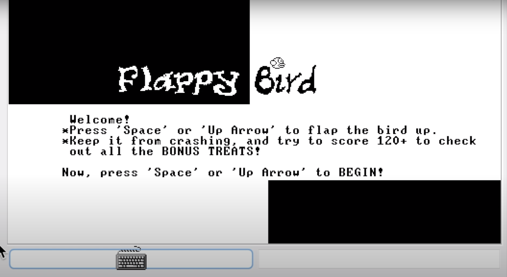

# Flappy-Bird-on-Hack

A hack flappy bird game I developed for the Coursera course, [nand to tetris II](https://www.coursera.org/learn/nand2tetris2).

Thank you Dr Noam Nisan and Dr Shimon Schocken for such a rewarding course and fun experience!

## Video demo
Watch a video demo [here](https://youtu.be/q9bV3S_kc2Y)

## How to run
You will need a Jack virtual machine to run it, find details [here](https://www.nand2tetris.org/).

